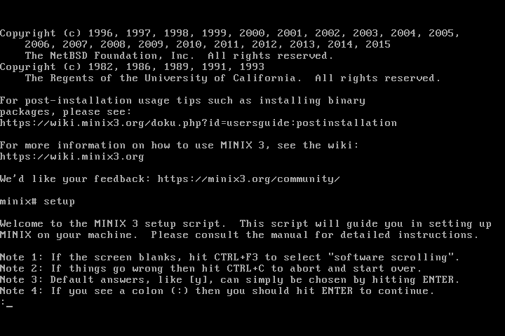
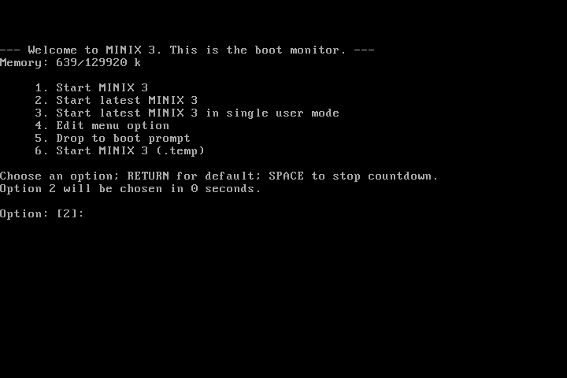
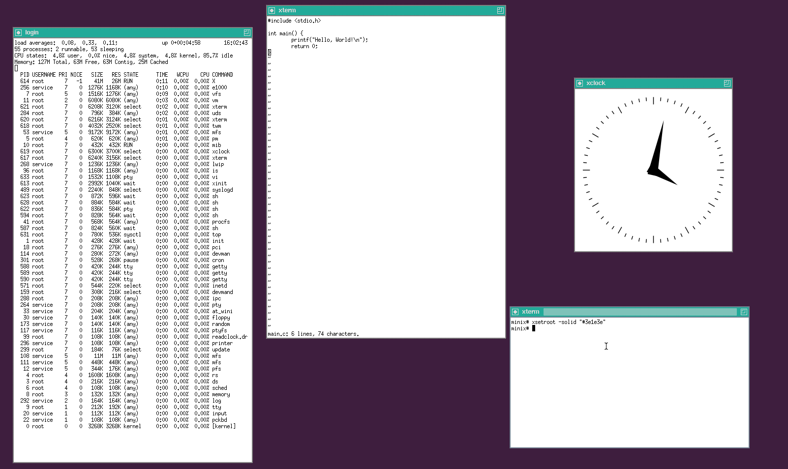
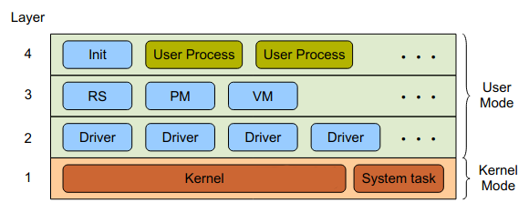
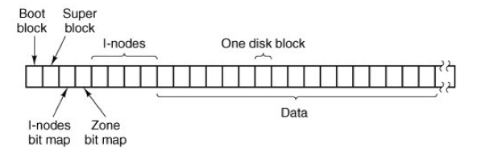

<!-- compile using: pandoc report.md -o report.pdf -->

\newpage

# Introduction to MINIX 3
In the realm of operating systems, MINIX stands as a remarkable example of a microkernel-based system that has significantly influenced the evolution of computer science and operating system design. Created by Andrew S. Tanenbaum in the 1980s as a teaching tool, MINIX has since garnered attention not only for its educational value but also for its impact on the development of modern operating systems, including its indirect role in the creation of Linux.

MINIX, short for "mini-UNIX," was initially designed with educational goals in mind, aiming to provide students with a simple, accessible, and well-documented platform for understanding the fundamentals of operating systems. It embodies the principles of modular design and abstraction, breaking down complex functionalities into manageable components, which has contributed to its enduring relevance as a case study for aspiring system developers.

# Building and Running MINIX 3

**Obtaining the Source Code**

The source code code for MINIX was obtained by cloning its Github repository.
Along with MINIX, the xsrc repository was also cloned which contains the
source code for X11 windowing system which is required in order to have a GUI.

```
$ git clone https://github.com/Stichting-MINIX-Research-Foundation/minix
$ git clone https://github.com/Stichting-MINIX-Research-Foundation/xsrc
$ cd minix
```

**Fixing Build Issues**

MINIX 3 fails to build when cross compiling with gcc version 10 or higher because of folloeing reasons:

- Since gcc version 10, the compiler defaults to `-fno-common` flag which prevents multiple definitions of same variable.
- Cross tools from `/external` fail to build because of a missing `#include <string>`.

The first issue was fixed by applying, a pull request (`#322`) from Github as a patch using the following commands. This pull request fixed the issue by using the `extern` keyword.

```sh
$ curl -L https://github.com/Stichting-MINIX-Research-Foundation/minix/pull/322.patch > fix_gcc.patch
$ git apply fix_gcc.patch
```

The second issue was fixed be adding the missing `#include`.

**Running the Build Script**

The script `/releasetools/x86_cdimage.sh` was executed in order to create a bootable image for `x86` architecture.
The script sets up a cross compiler toolchain required for cross building MINIX and then generate `minix_x86.iso` which can be booted in QEMU.

In order to get a graphical user interface, the `-x` and `-X` flags were passed to the build script.
`-x` enables building with MINIX and `-X` specifies the path to X11's source directory.

```sh
$ sh releasetools/x86_cdimage.sh -x -X ../xsrc
```

**Running MINIX 3 in QEMU**

In order to install MINIX, a hard drive image (i.e. a virtual disk) was created using `qemu-img`. Then a x86 virtual machine which booted from CD-ROM was started by running `qemu-system-i386` with `-cdrom` and `-boot d` flags.

```sh
$ qemu-img create minix.img 8G
$ qemu-system-i386 -m 2G -cdrom minix_x86.iso -drive file=minix.img,format=raw -boot d
```

At the login screen, we logged in as `root` and executed the `setup` script executed to install MINIX onto the virtual disk. Once the installation was complete, virtual machine was powered off by using the `poweroff` command. Finally, MINIX 3 was booted from the virtual disk.
```sh
$ qemu-system-i386 -m 2G -drive file=minix.img,format=raw
```

{width=3.5in}

{width=3.5in} 

{width=4in}

# Structure of MINIX 3
The structure of MINIX 3 revolves around the microkernel concept.
It employs a 4 level heirarchical structure which clearly seperates system services, device drivers and applications. 
The microkernel itself is very small and only provides essential services such as interrupt handling, process management, memory management, and inter-process communication (IPC) whereas device drivers, system services and other less critical components run in user space, isolated from the kernel.

{width=3.5in}

## Layer 1: Kernel  
The kernel is responsible for low level process management, scheduling, signal handling, memory management and device I/O. It also provides inter-process communication (IPC) for system processes via message passing. This layer is the only layer that has access to priviliged kernel mode instructions i.e. only the processes in this layer are running in kernel space. The kernel layer also includes the `SYSTEM` and `CLOCK` components which are resopnsible for handling kernel calls and hardware clock interrupts respectively.

## Layer 2: Device Drivers  
In MINIX, device drivers run as user space processes seperate from the kernel. These processes have access to kernel calls which can be used to read from or write to hardware I/O ports. Device drivers use these kernel calls to make interfacing with I/O devices possible. The major advantage of having device drivers running as user space processes is that even if a device driver crashes, the operating system can still continue to operate and even restart the crashed driver.

## Layer 3: Servers  
MINIX 3 follows a client-server model where servers, which are system processes running in user space, provide various services to the clients who request those services using syscalls. All servers are message driven i.e. when they are started, they enter their main loop and wait for a message. Once they recieve a message, they carry out the request and send a reply.
Some important servers are:  

- `PM` (Process Manager): manages user processes (creating, removing, managing priorities etc.)
- `RS` (Reincarnation Server): starts and stops system processes; provides fault recovery to system processes
- `VM` (Virtual Memory): maps virtual memory to physical memory; manages memory allocation/deallocation
- `VFS` (Virtual File Server): provides support for various file systems; provides abstractions over the file systems

## Layer 4: User Processes  
User Processes are programs executed by the user such as terminal emulators, file browsers, text editors, compilers, shell etc. These processes are the highest level processes and have the least priority.

# Message Passing and System Calls

In MINIX 3, all components of the operating system run as totally seperate processes. In order for the processes to remain synchronized, communicate and cooperate with each other, inter process communication (IPC) is essential. Message passing is MINIX's native form of IPC. Together with memory grants, they are the only low-level IPC directly understood by the micro-kernel. Message passing is done via rendezvous principle.

**Messages**

The messages are fixed-length 64 bytes of data. To transfer more effectively bigger amounts of data memory grants are used. Messages are composed of :

- The endpoint : a 4-byte identifier of who sent the message,
- Message type : a 4-byte message type identifier,
- Payload : 56 bytes of data.

All available message types can be found in `include/minix/ipc.h`.

**Endpoints**

A endpoint identifies a process uniquely among the operating system. It is composed of the process slot number concatenated with a generation number.
Servers are always given the same unique endpoint so that messages can be sent to them easily without having to figure out their endpoint first.

The reason behind this generation number is that a process slot may be recycled when a process dies, so unrelated processes may sequentially share the same process slot number, which would cause problems when delivering messages to a process which happened to share the same process slot than a unrelated predecessor. 

## Message Passing Implementation

Message passing is implemented using interrupts. `ipc_send`, `ipc_receive`, `ipc_notify` etc. calls can be used to perform message passing. These functions issue the software interrupt `int 33` to tell the kernel that a process is trying to perform message passing.

The kernel handles the interrupt by calling its `do_ipc` function. The `do_ipc` function supports many primitives for message passing. Some of them are:
 
- `SEND`  
When a process does a `SEND`, the lowest layer of the kernel checks to see if the destination is waiting for a message from the sender (or from ANY sender). If so, the message is copied from the sender’s buffer to the receiver’s buffer, and both processes are marked as runnable. If the destination is not waiting for a message from the sender, the sender is marked as blocked and put onto a queue of processes waiting to send to the receiver.

- `RECEIVE`  
When a process does a `RECEIVE`, the kernel checks to see if any process is queued trying to send to it. If so, the message is copied from the blocked sender to the receiver, and both are marked as runnable. If no process is queued trying to send to it, the receiver blocks until a message arrives.

- `NOTIFY`  
In cases where using normal messages could cause deadlock, the `NOCIFY` call can be used which does not block the sender if the destination is not waiting for a message. However, the notification is not lost. The next time the destination does a receive pending notifications are delivered before ordinary messages.

## System Call Implementation

Every system call is assigned a unique call number and is handled by a server. Servers always have a fixed endpoint. They are defined in `include/minix/com.h`.
Each system call, knows its own call number and server's endpoint, when a system call has to be made it constructs an appropriate message body and calls the `_syscall` function passing the server's endpoint, the system call number and the message body.
```c
    int _syscall(endpoint_t who, int syscallnr, message *msgptr);
```

`_syscall` then calls `ipc_sendrec` function to send the message to the server and waits for a reply. The server receives the message, carries out the request and then sends a response. 

Consider the implementation of the `fork` system call. It calls `_syscall` with `PM_PROC_NR` which is the endpoint of the `PM` server, `PM_FORK` which is the call number for `fork` and an empty message body. Similar definitions can be found for other system calls in `lib/libc/sys` folder.

```c
    pid_t fork(void) {
        message m;

        memset(&m, 0, sizeof(m));
        return(_syscall(PM_PROC_NR, PM_FORK, &m));
    }
```

# Processes and Memory Management

Process management and memory management are tied together. A process is allocated some memory when it is created. During its execution, the process may allocate and deallocate more memory as per its needs. In MINIX 3, process management is handeled by the process manager (`PM`) server and memory management is handled by the virtual memory (`VM`) server.
The virtual file server (`VFS`) is also involved in process management as it manages process' access to files, its working directory etc.

## Kernel

The kernel is responsible for the lowest level of process and memory management.

**Process Table**

The kernel maintains various information about the process such as its state, context, privileges etc. This information is used by the kernel when it performs context switches due to interrupts, syscalls etc. Some of the fields maintained in the kernel's process table are shown below:

```c
    struct stackframe_s p_reg; /* registers saved in stack frame */
    struct segframe p_seg; /* segment descriptors */
    proc_nr_t p_nr; /* number of this process */
    struct priv *p_priv; /* system privileges structure */
    volatile u32_t p_rts_flags; /* process state; runnable if zero */
```

**Kernel Calls**

The kernel also provides kernel calls which allow the `PM` and `VM` server access to many low level operations and also provide abstractions over certain architecture dependent operations. These calls also allow `PM` and `VM` to notify the kernel about changes in the process table. Some of the kernel calls  are as follows:

```c
    int sys_fork(endpoint_t parent, endpoint_t child, endpoint_t *child_endpoint, u32_t flags, vir_bytes *msgaddr);
    int sys_clear(endpoint_t proc_ep);
    int sys_exec(endpoint_t proc_ep, vir_bytes stack_ptr, vir_bytes progname, vir_bytes pc, vir_bytes ps_str);
    int sys_vmctl(endpoint_t who, int param, u32_t value);
```

- `sys_fork`: This kernel call allows the caller to notify the kernel that a process has forked. When this occurs, the kernel updates its process table and copies parents' entry to the childs' entry. It also sets the correct privileges for the child process.

- `sys_clear`: This kernel call is used to request the kernel to clear process slot when the process has exited. This routine removes the process from message and scheduling queues, cancels all timers set by the process and resets some process table values to default values.

- `sys_exec`: This kernel call is used to notify the kernel that a process has done a successful `exec()`. This routine sets up the process' state and updates its stack pointer and instruction pointer.

- `sys_vmctl`: This kernel call is used for memory management and allows to perform a variety of tasks such as setting address space, clearing page faults, flushing the TLB etc.
 
## Process Manager (PM)

The `PM` server handles process management system calls like `fork`, `exec`, `wait`, etc. The processor maintains the user mode counterpart of the kernel's process table however it does not have any information about the process' memory usage or the process' file usage. Thus it has to cooperates with `VM` and `VFS` to manage the process' state and also keep the process tables synchronized.

**Process Table**

`PM`'s process table is called `mproc`. It holds information required for user space process management. Some of which is shown below:

```c
    unsigned mp_flags; /* flag bits */
    pid_t mp_pid; /* process id */
    endpoint_t mp_endpoint; /* kernel endpoint id */
    int mp_parent; /* index of parent process */
    char mp_name[PROC_NAME_LEN]; /* process name */
    endpoint_t mp_scheduler; /* scheduler endpoint id */
```

**Message Handling**

`PM` is an message driven server. When it is started, it initializes itself and then waits for messages. `PM` has an array named `call_vec` which maps the messages to their handlers. Some messages handled by `PM` are as follows:

- `PM_FORK`: This message corresponds to the `fork` system call and tells `PM` that a process has forked and a child process should be created. If a free slot is available in the process table, `PM` will create an entry for the child process and copy the parent's data into the child process slot. It also calls `vm_fork` to let `VM` handle the memory part of the fork and then calls `tell_vfs` to notify `VFS` about the `fork`.

- `PM_EXIT`: This message tells `PM` that a process is trying to exit by calling the `exit` system call. When this message is received, `PM` calls its `exit_proc` function which releases the resources allocated to the process by calling `vm_exit` to release memory, `sys_clear` to clear process tables and `tell_vfs` to notify it about the exit.
 
- `PM_EXEC`: This message tells `PM` that a process is trying to execute the `exec` system call. The `PM` first notifies the `VFS` to load the requested program from the file system and build a complete stack image. After `VFS` finishes its task, it sends a reply to the `PM` at which point `PM` calls `sys_exec` to update the process' state as set by the `VFS`.

## Virtual Memory Server (VM)

The `VM` server tracks used and unused memory and also handles system calls like `mmap` and `munmap`. It is also responsible for allocating memory for a process when it is created (e.g. by calling `fork`) and freeing the memory once the process exits.

**Data Structures**

The following data structures describe the memory a process is using:

- Region (`region_t`): A region represents a contiguous range of virtual address space that has a particular type and some parameters. Regions have am array of pointers to physical regions in them. Every entry represents a page-sized memory block. If non-NULL, that block is instantiated and points to a physical region.

- Physical Region (`phys_region`): Physical regions exist to reference physical blocks. Physical blocks describe a physical page of memory. 

- Memory types (`mem_type`): Memory types exists to abstracts different behaviour of different memory types such as anonymous memory, memory mapped file etc. when it comes to forking, pagefaulting, etc.

- Page Table (`pt_t`): `pt_t` contains pointers to page directory and page tables. The page directory contains 1024 32-bit entries each pointing to a page table. Each page table is an array containing 1024 34-bit entries each pointing to the physical address of a page. Page directories and tables together used to map virtual address space to physical pages.

**Process Table**

`VM`'s process table is called `vmproc`. It holds information regarding memory allocated to the process. Some of which is shown below:

```c
    int vm_flags; /* flag bits */
    endpoint_t vm_endpoint; /* kernel endpoint id */
    pt_t vm_pt;	/* page table data */
    /* regions in virtual address space */
    region_avl vm_regions_avl; 
```

`VM` maintains a page table data structure (`vm_pt`) for each process and a 2-level page table system is employed to map virtual addresses to physical addresses.

**Message Handling**

`VM` is also message driven. Once it is started, it blocks and waits for messages. Similar to `PM`, `VM` also maintains an array named `vm_calls` which maps message call number to its handler.

`mmap` and `unmap` are some basic `VM` calls that can be called by any process. Calling `mmap` generates th `VM_MMAP` message and `unmap` generates `VM_MUNMAP` message. These messages are handled by `VM` as described below:

- `VM_MMAP`: This message is handled by the `do_mmap` function. `do_mmap` checks the type of mapping and then calls appropriate function. If the mapping is anonymous, then the `mmap_region` function is called which itself calls `map_page_region`. `map_page_region` traverses the `vm_regions_avl`, finds the free virtual address space, allocates a new region, maps it to phys blocks, inserts it into `vm_regions_avl` and returns the new region.

- `VM_MUNMAP`: This message is handled by the `do_munmap`. `do_munmap` essentially does the opposite of `do_mmap`. `do_munmap` calls `map_unmap_range` which breaks down the range into individual virtual memory pages and then releases the physical page associated with that virtual page.

Aside from the basic calls, `VM` may recieve calls from `PM` some of which are:

- `VM_FORK`: This message is generated by the `vm_fork` call. It is handled by `VM`'s `do_fork` function which creates an entry for the child process in `vmproc`, allocates a pagetable for the child, copies the parents' data to the child, notifies the kernel using `sys_fork` and finally binds the pagetable.

- `VM_EXIT`: This message is generated by the `vm_exit` call. It is handled by `VM`'s `do_exit` function which frees the pagetable and pages allocated by the process and also resets the values in the process table.
 
# Process Scheduling 

In MINIX 3, the scheduling algorithm, which picks which process to run next, is implemented in the kernel itself while the scheduling policy, which decides how to assign the priority and quantum, is implemented by an user mode scheduler. This helps to decouple the scheduling policy from the kernel thus making it possible to change the scheduling policy without modifying the kernel. This also makes it possible to run multiple user mode schedulers each with their own policy.

## Kernel Implementation
**Process Table**

The kernel's process table also holds scheduling data for the process which is shown below.

```c
    char p_priority; /* current process priority */
    u64_t p_cpu_time_left; /* cpu time left to use */
    unsigned p_quantum_size_ms; /* assigned quantum size in milliseconds */
    struct proc *p_scheduler; /* pointer to process table entry of scheduler */
    struct proc *p_nextready; /* pointer to next ready process */
```

**Scheduling Algorithm**

The kernel implements a Multilevel Feedback Queue (MLFQ) algorithm. It maintains `NR_SCHED_QUEUES` (default 16) queues of runnable processes. Each queue is implemented as a linked list. The process data itself is stored in the process table and contains a value `p_nextready` which points to the next entry in the queue. The head of each table is stored in the `rdy_head` array defined in `minix/kernel/proc.h`. Another array `rdy_tail` which stores pointers to the last process in each queue.

When a process is started, it is assigned an initial priority, maximum priority and quantum. The process is then enqueued into the queue corresponding to its priority. The priority of the process and quantum may change during its execution, depending on the scheduling policy, in which case the process has to be moved to another queue. The priority can range from 0  to `(NR_SCHED_QUEUES - 1)` where 0 is the highest priority and `(NR_SCHED_QUEUES - 1)` is the lowest. Device drivers get the highest priority, server processes get lower priority than device drivers and user processes get less priority than servers. Only the `IDLE` process can have the lowest `(NR_SCHED_QUEUES - 1)` priority and its priority cannot be increased.

Scheduling is Round Robin in each queue. Some of the functions used during scheduling are described below:

```c
    void dequeue(struct proc *rp);
    void enqueue(struct proc *rp);
    static struct proc * pick_proc(void);
    void context_stop(struct proc * p);
    void switch_to_user(void);
```

- `enqueue`  
This function is used to add a runnable process to one of the scheduling queues. If the process' priority is `p` then it should be enqueued into the `p`th queue. If `rdy_head[p]` is `NULL` then the `p`th queue is empty and a new queue is started with this process as its only entry. If `rdy_head[p]` is not `NULL` then `rdy_tail[p]` is updated and the process is set as the new tail of the queue.

- `dequeue`  
This function is used to remove processes that are no longer runnable from its scheduling queue. It iterates over the queue's linked list starting from `rdy_head[p]` and removes the process from the list.

- `pick_proc`  
This function decides which process to run now. The `pick_proc` function iterates over the `rdy_head` array (from highest to lowest priority) and checks the corresponding entry in ready head if the entry is not `NULL` then that entry is returned. If all the entries in `rdy_head` are `NULL` then there are no runnable processes so it returns `NULL`.

- `context_stop`  
This function is called before the entering the kernel due to interrupts, kernel calls etc. It performs CPU accounting and deducts the CPU cycles comsumed by the process during its current quantum from the `p_cpu_time_left` field in the process table.

- `switch_to_user`  
This function is called when returning back to userspace from the kernel. It is also called during startup after the kernel has finished setting up. This function tries to resume the process pointed to by the `proc_ptr` variable. If the process is not runnable, then another process is picked using `pick_proc` function. Once a process has been picked, the `pick_proc` variable is updated to point to the new process. Various flags of the new process are checked and then its `p_cpu_time_left` is checked. If `p_cpu_time_left` is zero then the process has run out of time for its current quantum and the kernel sends an out of quantum message to the scheduler for the process. When this occurs a `goto` is used to jump back and pick another process. Finally, once a runnable process is found, its context (stack and other segments) is restored and the process is allowed to continue execution. If no runnable process is available (i.e. `pick_proc` returns `NULL`), the `idle` function is called.

**Kernel Calls**

In order to implement the user mode scheduler, two kernel calls, `sys_schedctl` and `sys_schedule` are exposed to the scheduler.

```c
    int sys_schedctl(uint32_t flags, endpoint_t proc_ep, int priority, int quantum, int cpu);
    int sys_schedule(endpoint_t proc_ep, int priority, int quantum, int cpu, int niced);
```

- `sys_schedctl`  
    This kernel call can be used by the user mode scheduler to take over the scheduling process.
    When it is called, the kernel will make note of the scheduler's endpoint in its process table and send out of quantum messages to that scheduler.

- `sys_schedule`  
This kernel call is used to modify the process' priority and quantum of a runnable process.
The updated values for the priority and quantum are decided by the scheduler's policy.
It dequeues the process from its current queue, updates its priority and quantum and then
enqueues the process again into the correct queue based on its updated priority. 

**Default Scheduling Policy**

In certain cases where the user mode scheduler may be unavailable, such as during startup
or when the scheduler crashes, a fallback is required.
This default scheduling policy serves as a fallback for the user mode scheduler.

The default kernel policy is relatively simple and is applied only when the process'
`p_scheduler` pointer is set to `NULL`. When a process runs out of quantum, it is pre-empted
but immediately placed at the end of its current priority queue with a new
quantum (based on `p_quantum_size_ms`).

## User Mode Implementation
`SCHED` is the default user mode scheduler of MINIX 3 which implements a simple scheduling policy that decreases priority of a process when it runs out of quantum and periodically bumps up the priority of some processes to balance the queues.

**Process Table**
`SCHED` also maintains its own process table named `schedproc`.
`schedproc` holds data useful for scheduling a subset of which is shown below.

```c
    unsigned flags; /* flag bits */
    endpoint_t parent; /* parent process endpoint id */
    endpoint_t endpoint; /* process endpoint id */
    unsigned max_priority; /* this process' highest allowed priority */
    unsigned priority; /* the process' current priority */
    unsigned time_slice; /* this process's time slice or quantum */
```

**Message Handling**
Once `SCHED` is started, it blocks and waits for control messages from PM or out of quantum messages from processes.
The received messages may be of following types:

- `SCHEDULING_START` or `SCHEDULING_INHERIT`
These system calls occurs when a new process is created.
Whin this occurs, `SCHED` reserves a slot for the new process in `schedproc` by setting `flags` to `IN_USE` and sets all the values.
If message is `SCHEDULING_START` then default values are used for the process' quantum and priority otherwise the values are copied from its parents. 
The scheduler then calls `sys_schedctl` to take over this process' scheduling and finally calls `sys_schedule` to schedule the process.

- `SCHEDULING_STOP`
This system call occurs when a process exits. When this occurs, `SCHED` marks the slot in `schedproc` used for the process as free by setting `flags` to 0.

- `SCHEDULING_NO_QUANTUM`
This system call occurs when a process runs out of quantum.
Before this system call occurs, the process manager dequeues the process from its queue.
`SCHED` then lowers the priority of the process and reschedules the process using `sys_schedule`.

- System notification sent by `CLOCK`  
When this message is received, `SCHED` calls its `balance_queues` function. 
The `balance_queues` function finds all processes whose priority was decreased dure to `SCHEDULING_NO_QUANTUM`,
increases their priority by 1 (as long as priority is less than `max_priority`) and then
reschedules those processes. This happens every `BALANCE_TIMEOUT` (default 5) seconds.

# File System
In MINIX 3, the Virtual File Server (`VFS`) implements the file system in cooperation with one or more File Servers (`FS`). The File Servers take care of the actual file system on a disk partition. That is, they interpret the data structure on disk, write and read data to/from disk, etc. `VFS` sits on top of those File Servers and communicates with them and provides abstractions over them.

## Virtual File Server (`VFS`)
The `VFS` has three primary roles. First, it handles file related system calls such as `open`, `read`, `close`, `fstat` etc. Second, it maintains a part of the state belonging to a process. Third, it keeps track of endpoints that are supposed to be drivers for character or block special files.

**Message Handling**

Like all other servers, `VFS` is also message driven but unlike other servers, `VFS` utilizes user space threads. Upon start up, VFS spawns a number of worker threads (default 9). The main thread fetches requests and replies, and hands them off to idle or reply-pending workers, respectively. If no worker threads are available, the request is queued. There are 3 types of worker threads: normal, a system worker, and a deadlock resolver. 

- All standard system calls are handled by normal worker threads.
- Messages from PM and notifications from the kernel are taken care of by the system worker.
- The deadlock resolver handles jobs from system processes (i.e., File Servers and drivers) when there are no normal worker threads available.

VFS drives all File Servers and drivers asynchronously. While waiting for a reply, a worker thread is blocked and other workers can keep processing requests. Upon reply the worker thread is unblocked. 

**Data Structures**

- `fproc`: List of files opened by a process. Created by `fork` and destroyed by `exit`.
- `vmnt`: Virtual mount; holds information (device number, mount flags, root vnode etc.) about currently mounted file system. Created by `mount` and destroyed by `umount`.
- `vnode`: Virtual node; holds information (file size, file type, inode number etc.) about an open file. Created when a first process opens the file and destroyed when the last process closes the file.
- `filp`: File position into an open file. Created when a first process opens the file and destroyed when the last process closes the file.
- `dmap`: Mapping from a device number to a device driver.

**Locking**

Locking is required in `VFS` since multiple worker threads are used. Requirements of locking are as follows:

- System calls that update a file should be mutually exclusive.
- System calls should be isolated and not interfere with each other.
- No deadlocks or starvation should arise.
- Read only operations should not block each other.
- Request to one `FS` should not block access to other `FS`.

`VFS` uses locks in two cases: `read` and `write`. Concurrent reads are allowed but writes should be mutually exclusive. This is implemented using three-level lock:

- `TLL_READ`: Allows multiple threads to hold the lock.
- `TLL_READSER`: Allows multiple threads to hold the lock but only one thread is allowed serial access to the lock.
- `TLL_WRITE`: Full mutual exclusion.

In order to avoid deadlocks, VFS uses the following order:  
fproc -> [exec] -> vmnt -> vnode -> filp -> [block special file] -> [dmap]

Locking is done in many parts:

- `vmnt` (file system) Locking: In `vmnt` locking, provides `vnode` locks. They are used when an inode has to be created, opened, deleted etc. `TLL_READ` is used when performing read-only operations (`chdir`, `exec`, etc.) and fully independent write operations (`chmod`, `chown`, etc.). `TLL_READSER` is used when performing independent create and modify operations (such as `mkdir`, `link`, etc.). `TLL_WRITE` is used when performing delete and dependent write operations (such as `creat`, `rmdir`, etc.).

- `vnode` (open file) Locking: This locking is used to control access to in-use inodes. All read-only accesses to vnodes that merely read the vnode object's fields are allowed to be concurrent. However, all accesses that change fields of a vnode object must be exclusive. For creation and destruction of vnode objects, it is sufficient to serialize these accesses.

- `filp` (file position) Locking: Writes and reads to `filp` objects must always be mutually exclusive so that all system calls always use the latest version.

## File Servers (`FS`)
File Servers are user mode processes that manage the actual file system on the disk partition. File sercers implement various operations on the file system such as mounting, unmounting, lookup, read, write, etc as functions. Pointers to these functions are then stored in an `fsdriver` struct.

```c
struct fsdriver mfs_table = {
	.fdr_mount = fs_mount,
	.fdr_unmount = fs_unmount,
	.fdr_lookup	= fs_lookup,
	.fdr_putnode = fs_putnode,
	.fdr_read = fs_readwrite,
	.fdr_write = fs_readwrite,
    ...
}
```

The functions `fs_mount`, `fs_unmount`, `fs_lookup` etc. all have to be implemented by the file server and their implementation depends upon the specification of the file system.

The `fsdriver` library has the `fsdriver_task` function which acts as the main program of any file server task. The `fsdriver_task` function handles communication with the `VFS` and handles messages from it so that individual file server need not worry about implementing message handling. The `fsdriver_task` takes in the `fsdriver` struct populated by the file server which it uses to determine the correct function when serving requests from `VFS`.

File servers for various file systems have been implemented in MINIX such as `ext2`, `hgfs`, `mfs` etc. The native file system of MINIX is the MINIX file system which is handled by the `mfs` file server.

## MINIX File System
The MINIX file system is a network file server that happens to be running on the same machine as the caller. This design allows the file system to be modified, experimented with, and tested almost completely independently of the rest of MINIX 3. It also maked it easy to move the file system to any computer that has a C compiler, compile it there, and use it as a free-standing UNIX-like remote file server.
 
**File System Layout**

A MINIX 3 file system is a logical, self-contained entity with i-nodes, directories, and data blocks. It can be stored on any block device, such as a floppy disk or a hard disk partition.

{width=5in}

The file system consists of 6 components:

- Boot Block:  
The Boot Block is always stored in the first block and is always 1024 bytes (two disk sectors) in size. It contains the bootloader which is executed by the hardware when the computer is turned on. The bootloader begins the process of loading the operating system itself. Once the system has been booted, the boot block is not used any more.

- Superblock:  
The second block is the Superblock which is also 1024 bytes in size. It stores data about the file system, that allows the operating system to locate and understand other file system structures. For example, the number of inodes and zones, the size of the two bitmaps and the starting block of the data area.

- Inode Bitmap:  
The inode bitmap is a simple bitmap that is ued to track which inodes are in use and which ones are free. If an inode is free the the corresponding bit in the bitmap will be 0 otherwise it will be 1. Its size depends on the number of inodes which is specified in the Superblock.

- Zone Bitmap:  
A zone refers to a block of memory where data is stored. The zone bitmap works similar to the inode bitmap but it tracks zones instead of inodes.

- Inode Area:  
 Each file or directory is represented as an inode, which records metadata including type (file, directory, block, char, pipe), IDs for user and group, three timestamps that record the date and time of last access, last modification and last status change. An inode also contains a list of addresses that point to the zones in the data area where the file or directory data is actually stored.

- Data Area:  
It is the largest component of the file system where the actual file and directory data are stored. The data area is divided into zones which are pointed to by the inodes.

# Modification
## Concept
We decided to modify the scheduling policy implemented by `SCHED`. The default policy of `SCHED` decreases the process' priority when it runs out of quantum and bumps up its priority every `N` clock ticks as described in the Process Scheduling section. It does not change the quantum size assigned to the process.

We decided to modify the policy such that running out of quantum does not immediately decrease the process' priority. Instead, the process is allowed to run out of quantum a number of times. A counter is defined which tracks the number of times the process ran out of quantum. Once the counter reaches a certain value, then both priority and quantum size of the process is decreased. The `balance_queues` function which previously bumped up the priority of the process, now only increases the priority and quantum size if the counter is zero otherwise, it decrements the counter.

## Implementation

We declared some constants in `minix/servers/sched/schedule.c` to be used in the new scheduling policy.

```c
    // No. of times the process is allowed to run
    // out of quantum before decreasing priority
    #define MAX_NOQUANTUM_COUNT 5

    // Maximum time slice (quantum size) available
    // to each process
    #define MAX_TIME_SLICE 200

    // Minimum time slice (quantum size) available
    // to each process
    #define MIN_TIME_SLICE 50

    // Amount by which the time slice (quantum size)
    // should change
    #define TIME_SLICE_CHANGE 50
```

We added a field named `nqcounter` in the `schedproc` structure to keep track of the number of times the process ran out of quantum.

We modified the `do_noquantum` function in `minix/servers/sched/schedule.c` to impose our policy.

```c
    rmp->nqcounter ++; // increment the counter

    // if the counter has reached the limit then
    // reset the counter and lower its priority
    // and quantum size and reschedule it
    if (rmp->nqcounter >= MAX_NOQUANTUM_COUNT) {
        int reschedule = 0;
        rmp->nqcounter = 0;
        if (rmp->priority < MIN_USER_Q) {
            rmp->priority += 1;
            reschedule = 1;
        }

        if (rmp->time_slice > MIN_TIME_SLICE) {
            rmp->time_slice -= TIME_SLICE_CHANGE;
            reschedule = 1;
        }
        
        if (reschedule && 
            (rv = schedule_process_local(rmp)) != OK) {
            return rv;
        }
    }
```

Similarly, the `balance_queues` function was also modified.

```c
    // if the counter is 0 then increase
    // its priority and quantum size if 
    // possible and quantum size and reschedule it
    // otherwise decrement the counter
    if (rmp->nqcounter == 0) {
        int reschedule = 0;
        if (rmp->priority > rmp->max_priority) {
            rmp->priority -= 1;
            reschedule = 1;
        }
        if (rmp->time_slice < MAX_TIME_SLICE) {
            rmp->time_slice += TIME_SLICE_CHANGE;
            reschedule = 1;
        }
        if (reschedule) {
            schedule_process_local(rmp);
        }
    } else {
        rmp->nqcounter --;
    }
```

# References
- Operating Systems: Design and Implementation by Andrew S. Tanenbaum
- User Mode Scheduling in MINIX 3 <https://www.minix3.org/docs/scheduling/report.pdf>
- MINIX 3 wiki vminternals <https://wiki.minix3.org/doku.php?id=developersguide:vminternals>
- MINIX 3 wiki vfsinternals <https://wiki.minix3.org/doku.php?id=developersguide:vfsinternals>
- Wikipedia article on the MINIX file system <https://en.wikipedia.org/wiki/MINIX_file_system>
- MINIX 3 Discussion Group <https://groups.google.com/g/minix3>
- MINIX 3 Github repository <https://github.com/Stichting-MINIX-Research-Foundation/minix>
